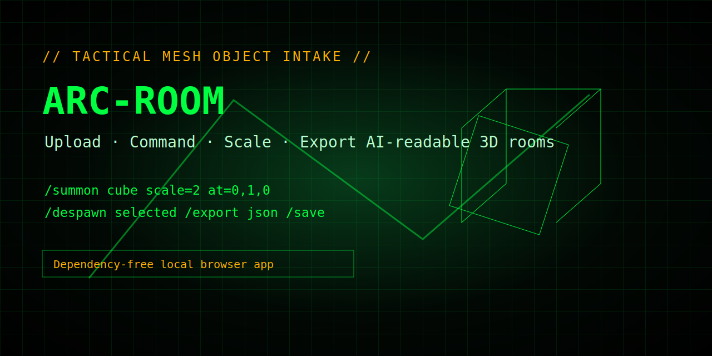
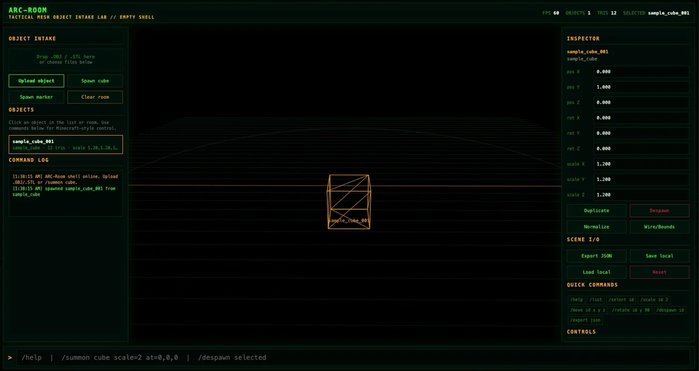
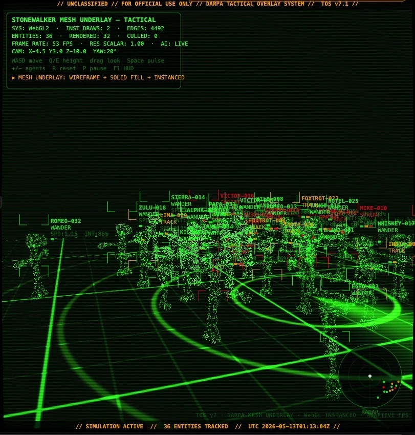

# ARC-Room: Tactical Mesh Object Intake Lab

[](#)
[](#)
[](#)
[](#supported-model-formats)
[](LICENSE)

**ARC-Room** is a lightweight tactical 3D model intake shell for uploading, testing, scaling, commanding, despawning, and exporting objects inside an AI-readable room.

It is built as a separate application from the Stonewalker prototype, but keeps the same tactical mesh / HUD / command-console visual language. The goal is not to replace Blender, Unity, or Unreal. The goal is to provide a fast room-scale object lab that runs locally, loads quickly, and gives humans or AI agents structured spatial state.



## Screenshots

| ARC-Room intake preview | Stonewalker tactical visual reference |
|---|---|
|  |  |

Raw JPEGs are included beside the optimized WebP previews in `assets/screenshots/`.

## What it does

- Runs locally by opening `index.html`.
- No install, no build step, no server, no external dependencies.
- Uploads `.obj` and `.stl` models.
- Imports/exports ARC-Room JSON scene files.
- Spawns primitive cube and marker test objects.
- Selects objects from the list or by clicking the room.
- Moves, rotates, scales, duplicates, hides, shows, locks, and despawns objects.
- Provides Minecraft-style slash commands.
- Shows tactical grid, wireframe objects, bounds, labels, HUD, and command receipts.
- Exports AI-readable scene state with transforms, bounds, tags, mesh data, and command history.

## Quick start

Open the app directly:

```txt
index.html
```

Or serve it locally:

```bash
python3 -m http.server 5173
# then open http://localhost:5173
```

No package install is required.

## Core commands

```txt
/help
/list
/select <id>
/summon cube scale=2 at=0,1,0
/summon marker scale=1 at=2,1,-2
/despawn <id>
/despawn selected
/despawn all
/scale <id> 2
/move <id> x y z
/rotate <id> y 90
/duplicate <id>
/tag <id> prop
/hide <id>
/show <id>
/grid on
/grid off
/export json
/save
/load
/reset
```

## Controls

| Input | Action |
|---|---|
| `WASD` | Pan room origin |
| `Q / E` | Lower / raise room origin |
| Mouse drag | Orbit camera |
| Mouse wheel | Zoom |
| Click object/list item | Select object |
| `Delete` | Despawn selected object |
| `F1` | Toggle HUD panels |

## Supported model formats

Current MVP:

- `.obj`
- `.stl`, ASCII or binary
- `.json`, ARC-Room scene export/import

Planned:

- `.glb` / `.gltf`
- material and texture manifests
- object thumbnails
- collision/physics metadata
- deterministic room replay receipts

## AI-readable export

ARC-Room exports structured scene JSON designed for AI/agent pipelines:

```json
{
  "app": "ARC-Room Tactical Mesh Object Intake Lab",
  "version": "0.1.0",
  "room": {
    "units": "meters",
    "gridSize": 1,
    "bounds": [40, 10, 40]
  },
  "objects": [
    {
      "id": "sample_cube_001",
      "name": "sample_cube",
      "position": [0, 1, 0],
      "rotation": [0, 0, 0],
      "scale": [1.2, 1.2, 1.2],
      "tags": ["sample"],
      "visible": true,
      "locked": false,
      "bounds": {
        "min": [-0.6, 0.4, -0.6],
        "max": [0.6, 1.6, 0.6]
      }
    }
  ],
  "receipts": []
}
```

## Repo structure

```txt
ARC-Room/
├─ index.html
├─ README.md
├─ LICENSE
├─ CHANGELOG.md
├─ CONTRIBUTING.md
├─ package.json
├─ assets/
│  ├─ screenshots/
│  │  ├─ arc-room-preview.jpeg
│  │  ├─ arc-room-preview.webp
│  │  ├─ stonewalker-reference-boot.jpeg
│  │  └─ stonewalker-reference-boot.webp
│  └─ social/
│     └─ arc-room-card.svg
├─ sample_models/
│  ├─ cube.obj
│  └─ pyramid.obj
└─ docs/
   ├─ COMMANDS.md
   ├─ OBJECT_SCHEMA.md
   ├─ ROADMAP.md
   ├─ RELEASE_CHECKLIST.md
   └─ SCREENSHOTS.md
```

## Why it is intentionally lightweight

ARC-Room is designed as an empty intake shell for testing and developing 3D models on weak hardware. It uses a tactical 2.5D canvas renderer instead of a heavy 3D engine so the first version stays simple, readable, and portable.

The first goal is reliability:

1. Load model.
2. Normalize model.
3. Spawn model.
4. Transform model.
5. Export model state.
6. Repeat.

Physics, animation, multiplayer, networking, accounts, cloud storage, and AI chat integration are intentionally later-stage features.

## Project identity

**Name:** ARC-Room  
**Subtitle:** Tactical Mesh Object Intake Lab  
**Tagline:** Upload, command, scale, and export AI-readable 3D room prototypes.

## Roadmap

See [`docs/ROADMAP.md`](docs/ROADMAP.md).

## License

MIT. See [`LICENSE`](LICENSE).
